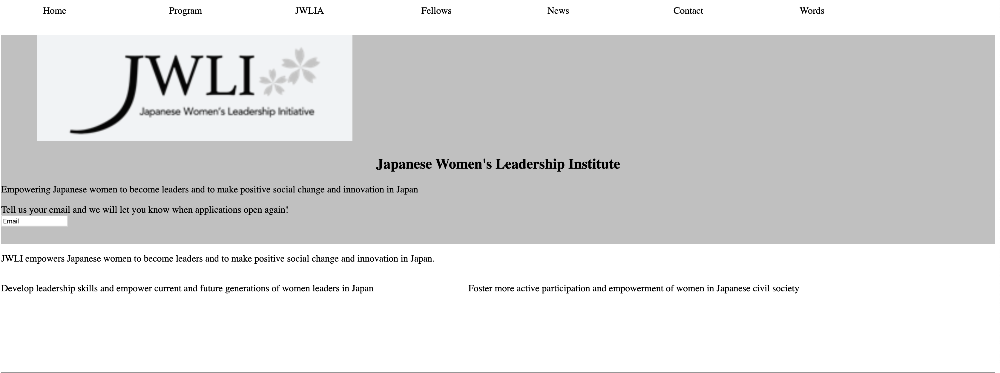

# Jwla
This push is a recreation of the JWLIA site.

## Link to live site:    

zikrejwlia.netlify.com

## How It's Made:

## Tech Used: HTML & CSS

This project saw me take a weeks worth of learning about how to properly float elements and showed me the progress I'd made in the matter.

## Lessons Learned:

I want to continue practicing my styling.

## Examples:

https://github.com/zikrehaimanot/todo-list-2019-week05/tree/answer

https://github.com/zikrehaimanot/calculator

https://github.com/zikrehaimanot/rpsGame

https://github.com/zikrehaimanot/foodist

https://github.com/zikrehaimanot/fizzbuzz
